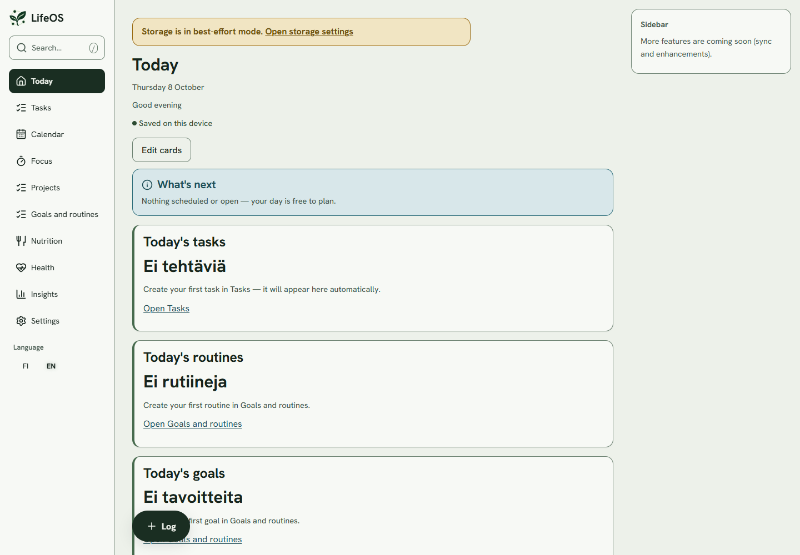
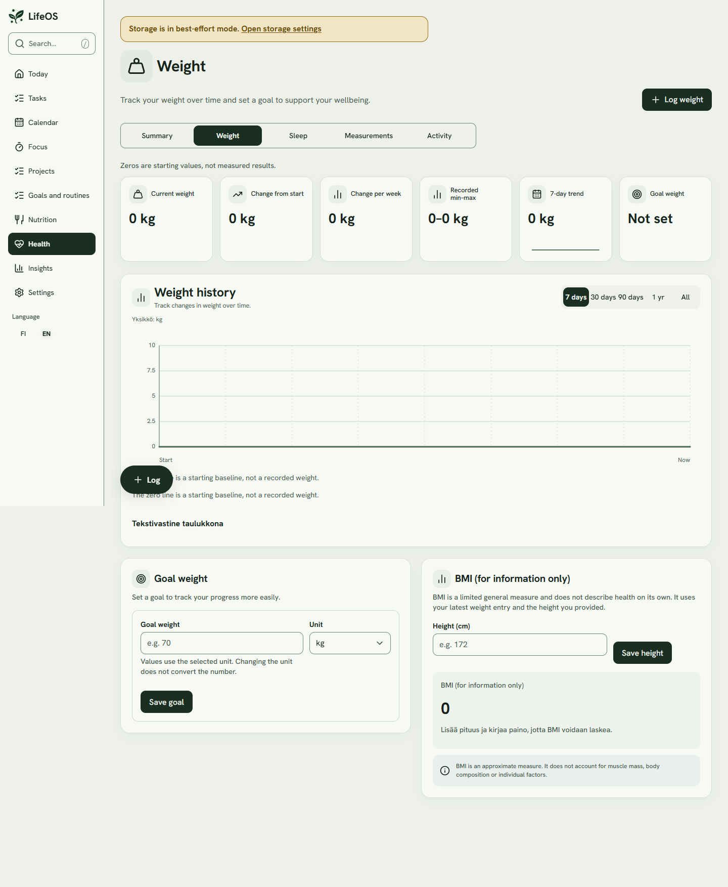
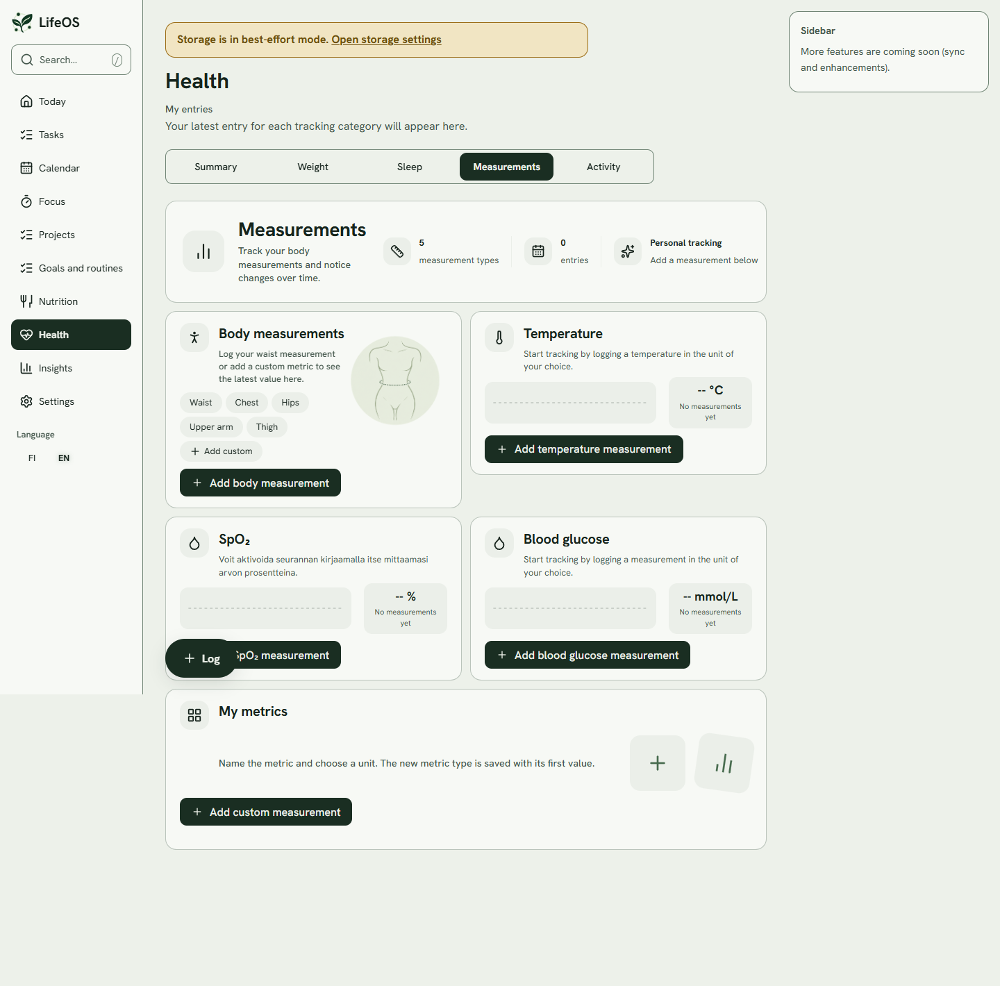

# Fitness App

A local-first fitness and productivity app built with React and TypeScript. This portfolio project combines fitness tracking and everyday planning in a responsive browser interface.

**Status: work in progress.** Core local features are functional. Some features and English translations remain unfinished. This is a development demo, not a production release.

## Features

- Weight and body measurement tracking
- Nutrition logging
- Tasks, calendar, routines, and focus sessions
- Responsive desktop and mobile layouts
- Finnish and English interface options
- Encrypted browser-local storage in normal mode
- An in-memory demo mode for trying the app without a passphrase

Google sign-in and Drive synchronization are not configured in this demo. Local features work without a Google account. Demo entries are discarded when the page reloads or closes; normal mode stores entries in the current browser.

## Screenshots

Screenshots use the English interface and demo mode. Some interface labels are still untranslated.





More desktop and mobile screenshots are available in [portfolio-images](portfolio-images).

## Run locally

Requirements: Node.js 20.19 or newer and npm 10 or newer. Node.js 22.19 or newer is recommended.

### Windows

Double-click `start-DEMO.bat` to open the in-memory demo at `http://127.0.0.1:5180/?storage=muisti`. The launcher installs dependencies with `npm ci` if needed.

- `start.bat`: normal mode with encrypted local storage and passphrase setup.
- `start-DEMO.bat`: temporary demo mode without passphrase setup.
- `AVAA-BUILD.bat`: production build preview; builds the app if the build folder is missing.

Run one launcher at a time. Stop the server with Ctrl+C in its terminal window.

### Terminal

From the repository root:

```bash
npm ci
node tools/ensure-dev-env.cjs
npm run dev
```

Open the URL printed by Vite. Append `/?storage=muisti` to try the in-memory demo.

To build and preview:

```bash
npm run build
npm run preview
```

The example environment uses a public placeholder Google client ID. It does not enable Google integration. Use synthetic entries when demonstrating the app.

## Technology

React, TypeScript, Vite, React Router, SQLite WASM with OPFS, Web Workers, and PWA tooling. Tests use Vitest, Testing Library, and Playwright.

```text
apps/lifeos-web/       React application
packages/domain/      Domain logic
packages/data/        Storage and data access
packages/ui/          Shared interface components
packages/config/      Configuration validation
packages/capabilities/ Browser capability handling
```

The internal workspace and package names use the original project name, LifeOS.

## Validation

```bash
npm run quality
npm run build
```

`quality` runs workspace type checks, ESLint, formatting checks, and unit/integration tests. The latest local validation passed 909 tests, lint, type checks, formatting checks, and the production build.

For browser tests:

```bash
npx playwright install chromium
npm run test:e2e
```

## Development

This project has been developed with AI assistance, including implementation fixes, testing, and documentation. It is being shared as a portfolio project while development continues.

Local environment files, generated builds, dependencies, and browser databases are excluded from version control. No open-source license has been selected yet.
